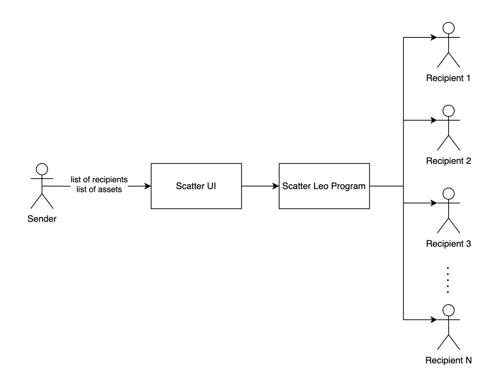

# distrofund.aleo

## Info
Two programs that could send up to 15 recipients credits using the transfer_private transition. One of the program would make this possible by submiting two transactions but we will have 0 overhead of records, other program works the following, you send to 2 recipients and there are 13 empty records created and send as well to a placeholder address with 0 microcredits but in one transaction.

## Diagram


## Build Guide

To compile this Aleo program, run:
```bash
leo build
```
This will generate your aleo instruction which you will use in the Deployment guide below.

To execute this Aleo program, run:
```bash
leo run <transition_name>
```
Note: In current version imports are still experimental feature and running locally would not work.

## Deploy guide

Currently for deploying a program that includes imports the only successful approach that I found is by deploying manually. Copy the main.aleo instructions that were generated in build/ folder from running `leo build` command and deploy it using -> https://aleo.tools/develop 